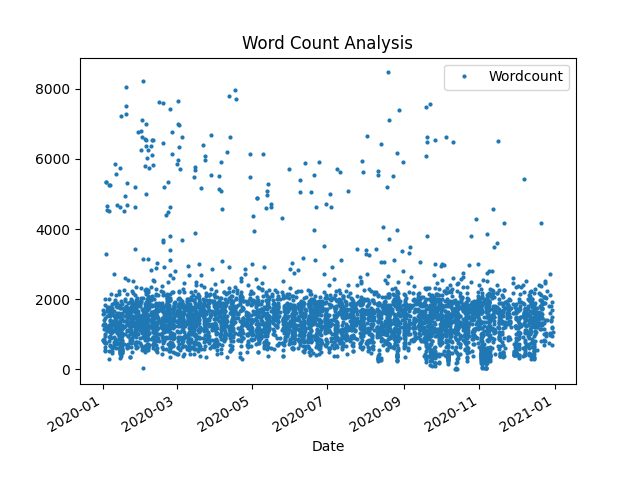

# How to Create Plots in Pandas

- Using the Wordcount Example
- Can be used with Sentimental Analysation

## Importing

- First for Getting the data from the Database

```
import sqlite3
```

- Then import modules for Plotting

```
import matplotlib.pyplot as plt
import pandas as pd
import numpy as np
```

## Getting from database

- Accessing Database from before

```
connection = sqlite3.connect("Analysing\Wordcount\wordcount.db")
cursor = connection.cursor()
```

- Loading data

```
cursor.execute("SELECT * FROM Politics;")
rows = cursor.fetchall()
```

- Close connection

```
connection.close()
```

## Plotting Basics

### Quick Visual Representation of the Data

- Create Dataframe

```
Dataframe = pd.DataFrame(rows, columns=[column[0] for column in cursor.description])
```

- Plot Data

```
rows.plot()
plt.show()
```

Pandas automatically does the rest


### Saving the Plot

```python
plt.savefig("Analysing\Wordcount\Pandas_Documentation\img1.png")
```

- Make sure to add this line before **plt.show()**

## Configure Custom Setting

1. The **ID line** is annoying me. Let's remove it

```
Dataframe = Dataframe.drop(columns=['id'])
```

---

2.  Customize **Plotting**:

- Remove Lines
- Reduce Dot Size

```
Dataframe.plot(style='o', markersize=2)
```

instead of:

```
Dataframe.plot()
```

---

4. **Custom Legend**

```
plt.legend(['Wordcount'])
```

---

5. **Custom X-Axis**

```
# Convert date column to datetime
Dataframe['date'] = pd.to_datetime(Dataframe['date'])

# Set the date as the index
Dataframe.set_index('date', inplace=True)

# Update Labels
plt.xlabel("Date")
plt.ylabel("")
```

5. **Custom Title**

```
plt.title("Word Count Analysis")
```

---

- Looks a lot better now:

  

---

# Regression

#### Prepare Regression

```
pip install scikit-learn
```

#### Prepare data for regression model

```
X = Dataframe.index.astype(np.int64).values.reshape(-1, 1)
y = Dataframe['wordcount']
```

#### Set up the model and fit ot

```
model = LinearRegression()
model.fit(X, y)
```

#### Get the parameters

```
y_pred = model.predict(X)
```

#### Plot it

```
plt.plot(Dataframe.index, y_pred, color='red')
```

Make sure to plot the line after you plot the Graph!

#### Update Legend

```
plt.legend(["Word Count", "Regression Line"])
```


---

---

# Plotting Multiple Graphs

See "Graph Multiple\.py"

### 1. Create Duplicates of everything

#### Get both Data Tables

```
cursor.execute("SELECT * FROM Politics;")
politics_rows = cursor.fetchall()
cursor.execute("SELECT * FROM World;")
world_rows = cursor.fetchall()
```

#### Create DataFrame

```
DataframePolitics = pd.DataFrame(
    politics_rows, columns=[column[0] for column in cursor.description])
DataframeWorld = pd.DataFrame(
    world_rows, columns=[column[0] for column in cursor.description])
```

#### Remove ID

```
DataframePolitics = DataframePolitics.drop(columns=['id'])
DataframeWorld = DataframeWorld.drop(columns=['id'])
```

#### Convert Date to DateTime

```
DataframePolitics['date'] = pd.to_datetime(DataframePolitics['date'])
DataframePolitics.set_index('date', inplace=True)
```

```
DataframeWorld['date'] = pd.to_datetime(DataframeWorld['date'])
DataframeWorld.set_index('date', inplace=True)
```

#### Plot the Graph

```
plt.plot(DataframePolitics.index,
         DataframePolitics['wordcount'], 'o', markersize=2)
plt.plot(DataframeWorld.index,
         DataframeWorld['wordcount'], 'o', markersize=2)
```

#### Create Regression and Plot it

```
# Linear regression for Politics
X_politics = DataframePolitics.index.astype(np.int64).values.reshape(-1, 1)
y_politics = DataframePolitics['wordcount']
model_politics = LinearRegression()
model_politics.fit(X_politics, y_politics)
y_pred_politics = model_politics.predict(X_politics)
plt.plot(DataframePolitics.index, y_pred_politics,
         color='red')

# Linear regression for World
X_world = DataframeWorld.index.astype(np.int64).values.reshape(-1, 1)
y_world = DataframeWorld['wordcount']
model_world = LinearRegression()
model_world.fit(X_world, y_world)
y_pred_world = model_world.predict(X_world)
plt.plot(DataframeWorld.index, y_pred_world,
         color='blue')
```

#### Update Labels

```
plt.xlabel("Date")
plt.ylabel("Word Count")
plt.legend(["Politics Word Count", "World Word Count",
           "Politics Regression Line", "World Regression Line"])
plt.title("Word Count Analysis for Politics and World")
```

### Result:


## Creating SubPlots

See "Graph Subplots\.py"
