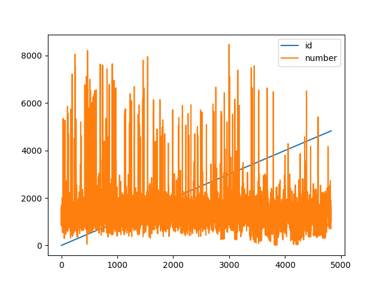

# How to Create Plots in Pandas

## Importing

- First for Getting the data from the Database

```
import sqlite3
```

- Then import modules for Plotting

```
import matplotlib.pyplot as plt
import pandas as pd
import numpy as np
```

## Getting from database

- Accessing Database from before

```
connection = sqlite3.connect("Analysing\Wordcount\wordcount.db")
cursor = connection.cursor()
```

- Loading data

```
cursor.execute("SELECT * FROM Wordcount;")
rows = cursor.fetchall()
```

- Close connection

```
connection.close()
```

## Plotting Basics

### Quick Visual Representation of the Data

- Create Dataframe

```
Dataframe = pd.DataFrame(rows, columns=[column[0] for column in cursor.description])
```

- Plot Data

```
rows.plot()
plt.show()
```

Pandas automatically does the rest



### Saving the Plot

```python
plt.savefig("Analysing\Wordcount\docs\img1.png")
```

- Make sure to add this line before **plt.show()**

## Configure Custom Setting

1. The **ID line** is annoying me. Let's remove it

```
Dataframe = Dataframe.drop(columns=['id'])
```

---

2.  Now only show the points **without lines**:

```
Dataframe.plot(style='o')
```

instead:

```
Dataframe.plot()
```

---

<!-- 3. Make **Fullscreen**

```
manager = plt.get_current_fig_manager()
manager.full_screen_toggle()
``` -->

3.  Reduce **Dot Size**:

```
Dataframe.plot(style='o', markersize=2)
```

instead:

```
Dataframe.plot(style='o')
```

4. **Custom Legend**

```
plt.legend(['Wordcount'])
```

## Types in Pandas

Aside from line plots, pandas provides several other plotting options. Here’s how to list them:

```python
# List available plot methods in pandas
[method_name for method_name in dir(air_quality.plot) if not method_name.startswith("_")]
```

## Separate Subplots for Each Column

To display each column in a separate subplot, use the `subplots=True` argument:

```python
# Area plot with separate subplots for each station
axs = air_quality.plot.area(figsize=(12, 4), subplots=True)
plt.show()
```


## Customizing and Saving Plots

For further customization, we can interact directly with the Matplotlib figure and axes:

```python
# Customize plot with labels and save to file
fig, axs = plt.subplots(figsize=(12, 4))
air_quality.plot.area(ax=axs)
axs.set_ylabel("NO₂ concentration")
fig.savefig("no2_concentrations.png")
plt.show()
```


> **Remember**:
>
> - `.plot.*` methods work on both Series and DataFrames.
> - Each column is plotted as a different element (e.g., line, boxplot).
> - Pandas plots are Matplotlib objects, so you can fully customize them with Matplotlib.

---
