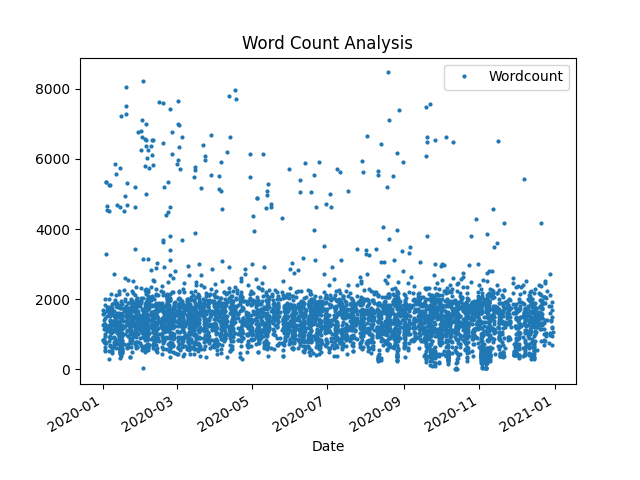

# How to Create Plots in Pandas

## Importing

- First for Getting the data from the Database

```
import sqlite3
```

- Then import modules for Plotting

```
import matplotlib.pyplot as plt
import pandas as pd
import numpy as np
```

## Getting from database

- Accessing Database from before

```
connection = sqlite3.connect("Analysing\Wordcount\wordcount.db")
cursor = connection.cursor()
```

- Loading data

```
cursor.execute("SELECT * FROM Wordcount;")
rows = cursor.fetchall()
```

- Close connection

```
connection.close()
```

## Plotting Basics

### Quick Visual Representation of the Data

- Create Dataframe

```
Dataframe = pd.DataFrame(rows, columns=[column[0] for column in cursor.description])
```

- Plot Data

```
rows.plot()
plt.show()
```

Pandas automatically does the rest


### Saving the Plot

```python
plt.savefig("Analysing\Wordcount\docs\img1.png")
```

- Make sure to add this line before **plt.show()**

## Configure Custom Setting

1. The **ID line** is annoying me. Let's remove it

```
Dataframe = Dataframe.drop(columns=['id'])
```

---

2.  Now only show the points **without lines**:

```
Dataframe.plot(style='o')
```

instead of:

```
Dataframe.plot()
```

---

3.  Reduce **Dot Size**:

```
Dataframe.plot(style='o', markersize=2)
```

instead of:

```
Dataframe.plot(style='o')
```

---

4. **Custom Legend**

```
plt.legend(['Wordcount'])
```

---

5. **Custom X-Axis**

```
# Convert date column to datetime
Dataframe['date'] = pd.to_datetime(Dataframe['date'])

# Set the date as the index
Dataframe.set_index('date', inplace=True)

# Update Labels
plt.xlabel("Date")
plt.ylabel("")
```

---

- Looks a lot better now:

  

---
