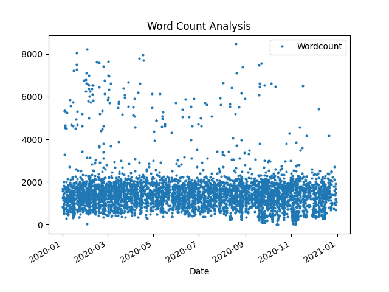
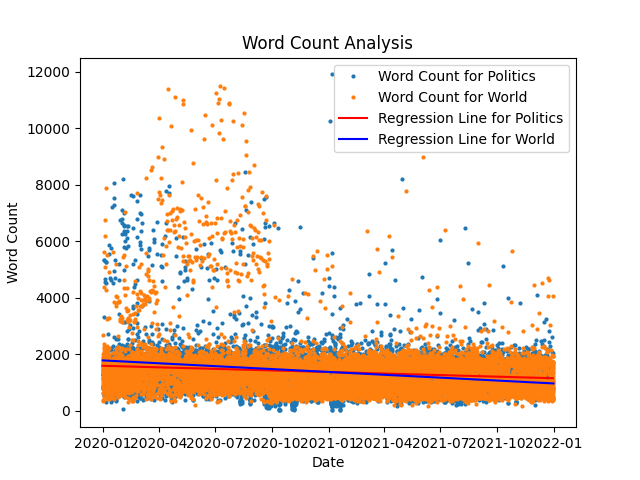

# How to Create Plots in Pandas

- Creating Plots in Pandas without accessing the function I created ([`Plotting.py`](../Plotting.py))

- Using the Wordcount Example

* See `Analysing/Wordcount/Graph.py`
* Docs: [Wordcount](../Wordcount/)

## Importing

- First import modules for Plotting

```python
import matplotlib.pyplot as plt
import pandas as pd
import numpy as np
```

- Then getting the data from the Database

```python
import sqlite3
```

## Getting from database

- Accessing Database from before

```python
connection = sqlite3.connect("Analysing\Wordcount\wordcount.db")
cursor = connection.cursor()
```

- Loading data

```python
cursor.execute("SELECT * FROM Politics;")
rows = cursor.fetchall()
```

- Close connection

```python
connection.close()
```

## Plotting Basics

### Quick Visual Representation of the Data

- Create Dataframe

```python
Dataframe = pd.DataFrame(rows, columns=[column[0] for column in cursor.description])
```

- Plot Data

```python
rows.plot()
plt.close()
```

Pandas automatically does the rest


### Saving the Plot

````python
plt.savefig("Analysing\Wordcount\Pandas_Documentation\img1.png")
```python

- Make sure to add this line before **plt.close()**

## Configure Custom Setting

1. The **ID line** is annoying me. Let's remove it

```python
Dataframe = Dataframe.drop(columns=['id'])
````

---

2.  Customize **Plotting**:

- Remove Lines
- Reduce Dot Size

```python
Dataframe.plot(style='o', markersize=2)
```

instead of:

```python
Dataframe.plot()
```

---

4. **Custom Legend**

```python
plt.legend(['Wordcount'])
```

---

5. **Custom X-Axis**

```python
# Convert date column to datetime
Dataframe['date'] = pd.to_datetime(Dataframe['date'])

# Set the date as the index
Dataframe.set_index('date', inplace=True)

# Update Labels
plt.xlabel("Date")
plt.ylabel("")
```

5. **Custom Title**

```python
plt.title("Word Count Analysis")
```

---

- Looks a lot better now:

  

---

# Regression

#### Prepare Regression

```python
pip install scikit-learn
```

#### Prepare data for regression model

```python
X = Dataframe.index.astype(np.int64).values.reshape(-1, 1)
y = Dataframe['wordcount']
```

#### Set up the model and fit ot

```python
from sklearn.linear_model import LinearRegression
model = LinearRegression()
model.fit(X, y)
```

#### Get the parameters

```python
y_pred = model.predict(X)
```

#### Plot it

```python
plt.plot(Dataframe.index, y_pred, color='red')
```

Make sure to plot the line after you plot the Graph!

#### Update Legend

```python
plt.legend(["Word Count", "Regression Line"])
```


---

---

# Plotting Multiple Graphs

### 1. Create Duplicates of everything

#### Looping through the creation of the scatter plots

```python
for i, topic in enumerate(topics):
    cursor.execute(f"SELECT * FROM {topic};")
    rows = cursor.fetchall()

    Dataframe = pd.DataFrame(
        rows, columns=[column[0] for column in cursor.description])

    Dataframe = Dataframe.drop(columns=['id'])
    Dataframe['date'] = pd.to_datetime(Dataframe['date'])
    Dataframe.set_index('date', inplace=True)

    plt.plot(Dataframe.index,
             Dataframe['wordcount'], 'o', markersize=2, color=colors[i])
```

#### Then Graph the Regression line on top

```python
for i, topic in enumerate(topics):
    cursor.execute(f"SELECT * FROM {topic};")
    rows = cursor.fetchall()

    Dataframe = pd.DataFrame(
        rows, columns=[column[0] for column in cursor.description])

    Dataframe = Dataframe.drop(columns=['id'])
    Dataframe['date'] = pd.to_datetime(Dataframe['date'])
    Dataframe.set_index('date', inplace=True)

    X = Dataframe.index.astype(np.int64).values.reshape(-1, 1)
    y = Dataframe['wordcount']
    model = LinearRegression()
    model.fit(X, y)
    y_pred = model.predict(X)
    plt.plot(Dataframe.index, y_pred, color=colors_reg[i])
```

#### Update Legend

```python
legend1 = [f"Word Count for {topic}" for topic in topics]
legend2 = [f"Regression Line for {topic}" for topic in topics]
plt.xlabel("Date")
plt.ylabel("Word Count")
plt.legend(legend1 + legend2)
plt.title("Word Count Analysis")

plt.savefig("Analysing\Wordcount\output\Both.png")
plt.show()
```

### Result:


